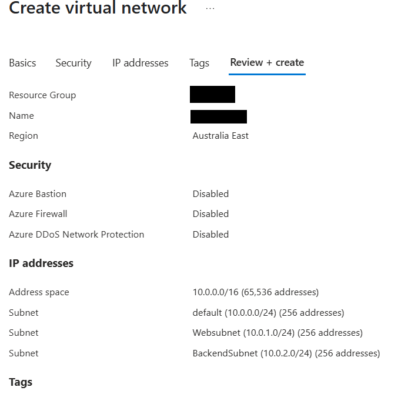
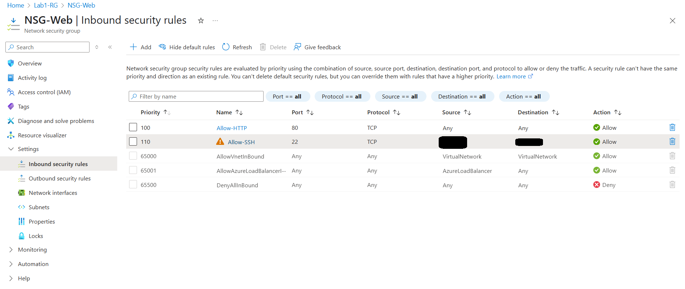
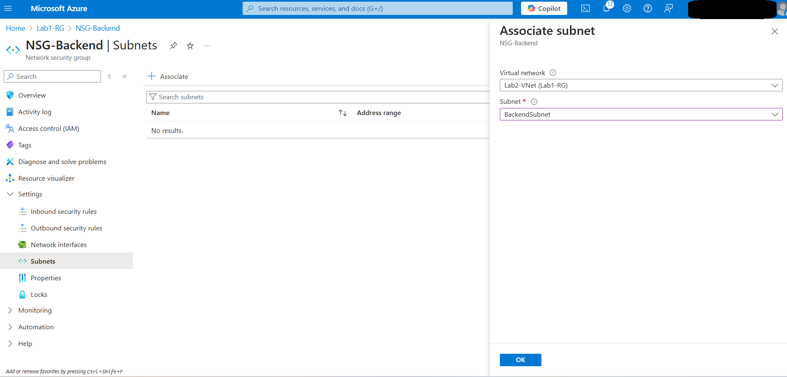

# Lab 2: Create a Virtual Network with Subnets and NSGs in Azure

## Overview
This lab demonstrates how to create a virtual network with multiple subnets and apply Network Security Groups (NSGs) for network-level control in Azure.

## Objectives
- Create a VNet with custom address space
- Define two subnets: WebSubnet and BackendSubnet
- Apply NSGs with specific inbound rules
- Associate NSGs with the correct subnet

## Resources Created
- Resource Group: Lab2-RG
- Virtual Network: Lab2-VNet
- Subnets: WebSubnet, BackendSubnet
- NSGs: NSG-Web, NSG-Backend

## Screenshots

### 1. VNet and Subnets Created  
 

### 2. NSG Rules and Associations  
  

## Notes
- NSG-Web allows HTTP (80) and SSH (22)
- NSG-Backend allows RDP (3389)
- Subnet-level NSG association ensures security boundaries per subnet
