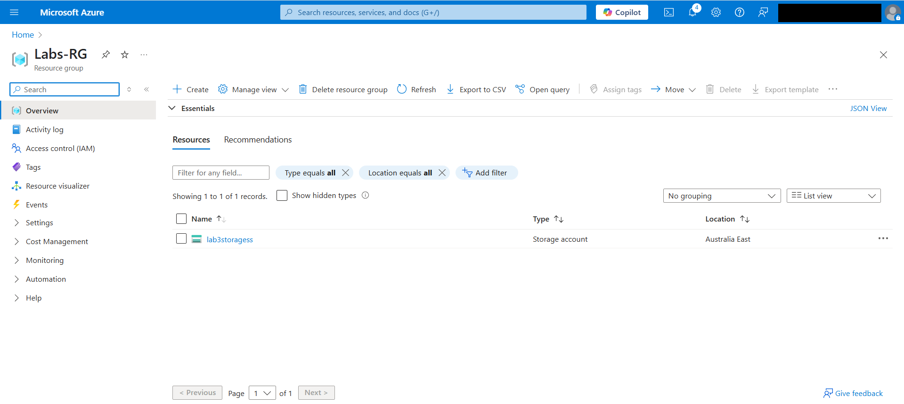
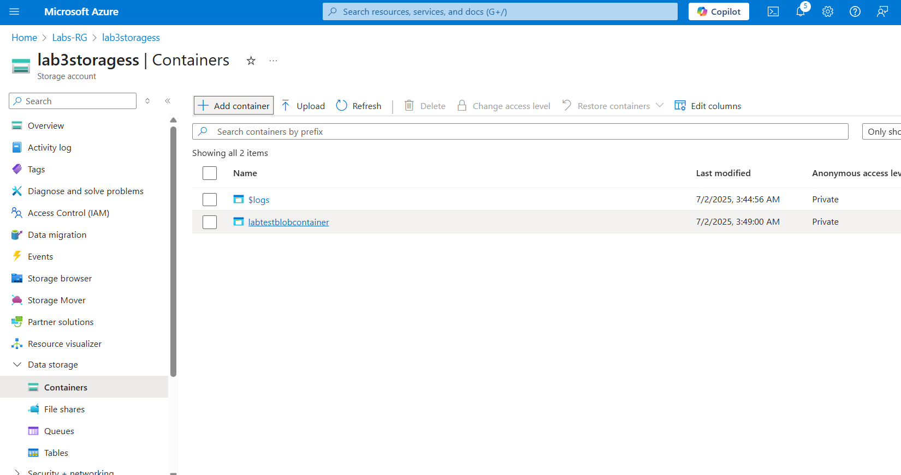
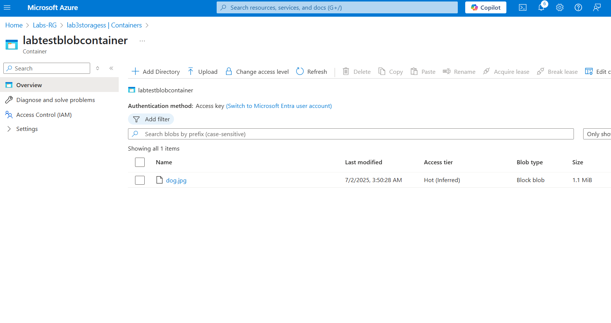
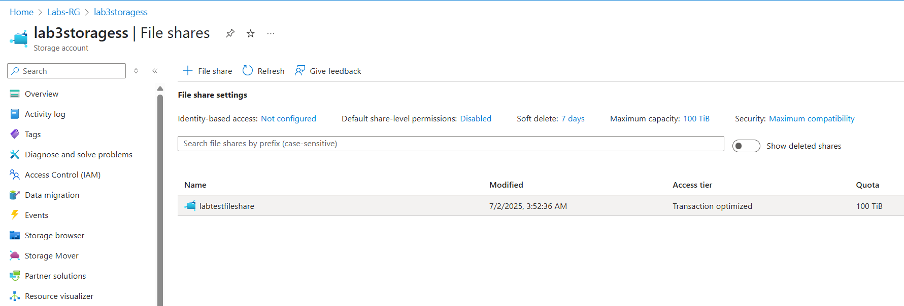
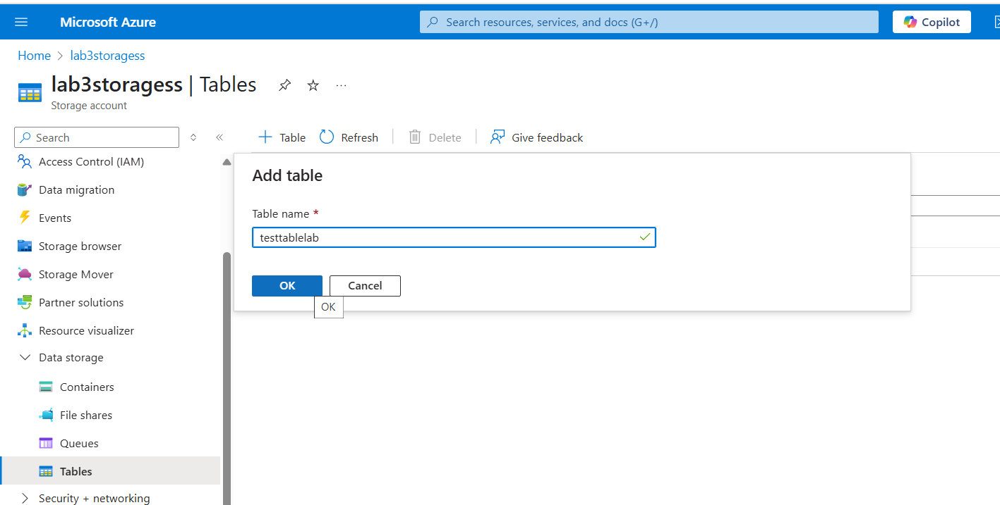

# Lab 3: Azure Storage Account (Blob, File, Table)

## Overview
This lab demonstrates how I created and used different Azure storage types including Blob, File Share, and Table storage using the Azure Portal.

## Objectives
- Create a standard storage account
- Use Blob storage to upload files
- Create an SMB-compatible file share
- Explore Table storage with custom entities
- Understand access tiers (Hot, Cool, Archive)

## Resources Created
- Resource Group: Labs-RG
- Storage Account: labstoragess
- Blob Container: labtestblobcontainer
- File Share: labtestfileshare
- Table: LabTestTable

## Screenshots

### 1. Storage Account Created  

### 2. Blob Container + File Uploaded  
  

### 3. File Share Created  

### 4. Table Storage Setup  

## Notes
- Blob storage used for file uploads
- File shares can be mounted on VMs using SMB
- Table storage used for structured NoSQL data
- Used "Hot" access tier for quick testing
