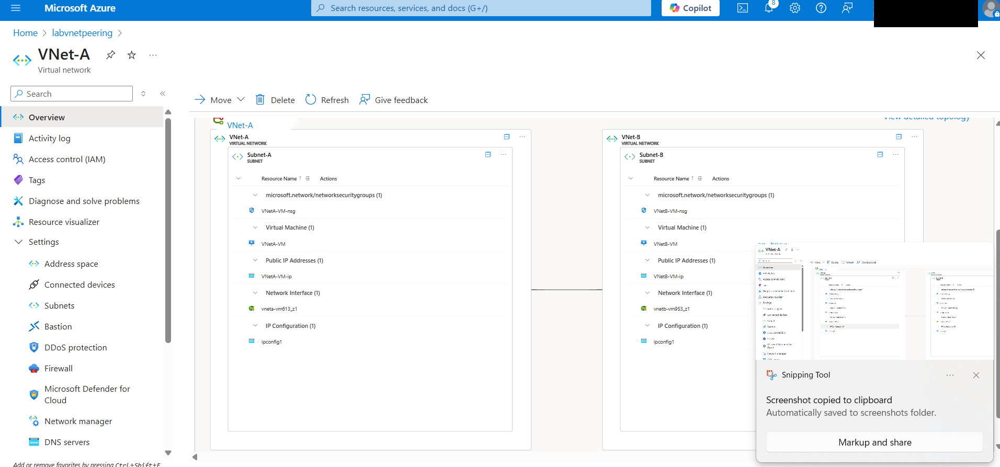

# Lab 6: Azure VNet Peering (VNet-to-VNet Communication)

##Overview
This lab demonstrates my understanding to securely connect two isolated Azure Virtual Networks (VNets) using **VNet Peering**. Each VNet hosts a virtual machine, and I tested private communication between them using ICMP (ping).

##Objectives
- Create two VNets: `VNet-A` and `VNet-B`
- Deploy one Ubuntu VM in each VNet
- Peer the VNets to enable private communication
- Configure NSGs to allow ICMP traffic
- Validate peering by pinging between VMs
- Clean up all resources after the test

##Technologies Used
- Azure Virtual Network
- Network Security Groups (NSG)
- Azure VM (Ubuntu)
- Azure VNet Peering
- Azure Portal

##Screenshots

### 1. Topology showing both VNets along with VMs 

### 2. SSH into VM A in Vnet A and successfully pinging private IP of VM B in Vnet B 

##Clean-up
The entire lab was deleted by removing the resource group after testing.

##Real-World Relevance
- Enables secure inter-service communication between environments (e.g., app → DB)
- Avoids public IP exposure
- Used in production architectures across dev, test, and prod separation
